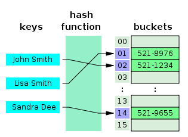
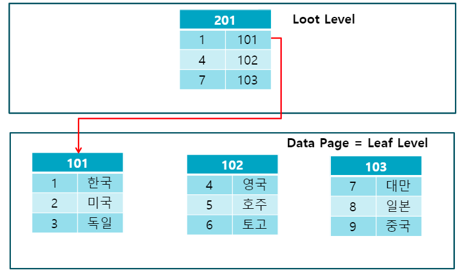
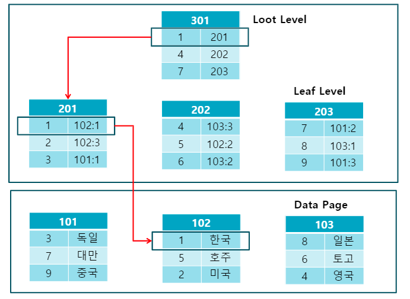

 
💡 데이터베이스의 인덱스에 대해서 설명해주세요.

## 설명
인덱스는 추가적인 저장 공간을 활용하여 테이블의 검색 속도를 향상시키기 위한 자료구조입니다. 장점으로는 빠른 검색이 있고 단점으로는 관리를 위한 추가 작업과 많은 저장공간의 요구 등이 있습니다.
## 정리
### 인덱스란?
- 추가적인 쓰기 작업과 저장 공간을 활용하여 데이터베이스 테이블의 검색 속도를 향상시키기 위한 자료구조
- select 뿐만 아니라 update, delete 에서도 성능 향상이 존재한다.
  - 해당 값을 찾는 과정이 존재하기 때문.
### 인덱스 관리
- INSERT: 새로운 데이터에 대한 인덱스 추가
- DELETE: 삭제하는 데이터의 인덱스를 사용하지 않도록 작업
- UPDATE: 기존의 인덱스를 사용하지 않음 처리하고, 갱신된 데이터에 대해 인덱스 추가
### 인덱스 장단점
#### 장점
- 테이블을 조회하는 속도와 그에 따른 성능을 향상시킬 수 있다.
- 전반적인 시스템의 부하를 줄일 수 있다.
#### 단점
- 인덱스를 관리하기 위해 DB 의 약 10%에 해당하는 저장공간이 필요하다.
- 인덱스를 관리하기 위해 추가 작업이 필요하다.
- 인덱스를 잘못 사용할 경우 오히려 성능 저하가 발생한다.
  - DELETE, UPDATE 연산
#### 사용하면 좋은 경우
- 규모가 큰 테이블
- INSERT, UPDATE, DELETE 가 자주 발생하지 않는 컬럼
- JOIN, WHERE, ORDER BY 에 자주 사용되는 컬럼
- 데이터의 중복도가 낮은 컬럼
- Cardinality 가 높은 컬럼
  - Cardinality: 특정 데이터 집합의 유니크한 값의 개수
  - 성별 -> 낮은 Cardinality
  - 주민번호 -> 높은 Cardinality
### 인덱스의 자료 구조
#### Hash Table
- Hash Table: Key-Value 로 이루어진 데이터를 저장하는 자료구조
- Key 값을 이용해 고유한 인덱스를 생성해 이후 해당하는 인덱스에 저장된 값을 꺼내오는 구조.
  
- 버켓: 해시 함수를 통해 얻어진 키 값들을 인덱스로 사용하는 배열
- 평균적인 성능: O(1)
  - 해시를 통한 인덱스 접근
  - 해시 함수에 따라 해시 충돌이 발생할 경우 성능 저하가 존재
- 사용할 수 있는 경우가 제한적
  - `=` 연산에 특화
  - 값이 조금이라도 다르면 완전히 다른 해시 값을 생성하므로 부등호를 지원할 수 없다.
  - 또한 정렬이 되어있지 않아 Full Scan 에도 불리
#### B Tree
- B Tree: 자식 노드가 2개 이상인 균형 트리
  - 왼쪽 자식들은 Key 값보다 작은 값을, 오른쪽 자식들은 Key 값보다 큰 값을 가진다. 
- Key 값으로 특정 컬럼의 값을, Value 에 데이터의 위치를 저장
- 항상 Key 값을 기준으로 오름차순 정렬
  - 부등호 연산에 효율적
  - 다만 말단 노드끼리 이어져 있지 않고, 중위 탐색만 지원하기 때문에 순차 검색 효율이 매우 좋지는 않다.
- 평균적인 탐색 성능: O(logN)
  - 균형 트리이기 때문
  - INSERT, UPDATE, DELETE 연산이 빈번할 시 불리
    - 해당 연산 시 재배치하는 과정을 거쳐 오버헤드 발생
#### B+ Tree
- B+ Tree: B Tree 를 개선시킨 자료구조. 
  - 말단 노드에만 데이터를 저장. 나머지 노드에는 데이터를 위한 인덱스만 가지고 있다.
  - 말단 노드끼리 LinkedList 로 연결되어 있다.
- 부등호 검색에 유리
  - 말단 노드를 통해 순차 검색을 하므로 유리
- 평균적인 탐색 성능: O(logN)
## 참조
- https://tecoble.techcourse.co.kr/post/2021-09-18-db-index/
- https://mangkyu.tistory.com/96
---
 
💡 인덱스 테이블을 해시 테이블과 B+트리로 구성할때 각각이 어떤 차이점이 있을까요?

## 설명
인덱스 테이블을 해시 테이블로 사용할 경우 등호 연산이 유리합니다. 검색하려는 값의 해시 값을 통해 빠른 검색이 가능합니다. 반면에 B+ 트리로 구성된 경우 부등호 연산에 유리합니다. 비교하는 값을 찾은 후 순차 접근을 통해 해시 테이블에 비해 빠르게 검색할 수 있습니다.

---
 
💡 클러스터형 인덱스에 대해서 설명해주세요.

## 설명
클러스터형 인덱스는 테이블의 데이터가 인덱스 컬럼을 기준으로 순서를 정의하는 것을 의미합니다. 테이블 당 하나의 클러스터링 인덱스만 가질 수 있고 데이터가 자주 업데이트 되지 않고 읽기 작업이 많은 경우에 유리합니다. 
## 정리
### 클러스터형 인덱스
- clustered index, primary index
- 인덱스 파일의 정렬 순서와 데이터가 담긴 레코드 파일의 순서가 일치
- 테이블의 데이터가 물리적으로 저장되는 순서를 정의한다.
  - 특정 컬럼을 기준으로 데이터들을 정렬시킨다.
- 테이블 당 하나의 클러스터형 인덱스를 가질 수 있다.
  - 정렬 기준은 하나만
  - PK 가 클러스터형 인덱스로 자동으로 설정된다.
- 데이터를 삽입, 삭제, 갱신할 경우 해당 데이터 이후 모든 컬럼을 이동시키는 비용이 발생하므로 인덱스 설정의 주의가 필요하다.
- 유리한 경우
  - 테이블의 데이터가 자주 업데이트 되지 않는 경우
  - 항상 정렬된 방식으로 데이터를 반환하는 경우
  - 읽기 작업이 많은 경우

### 논 클러스터형 인덱스
- secondary index
- 군집화되어있지 않은 인덱스 타입
  - 테이블의 값들이 정렬되지 않음
- 테이블의 값이 저장되지 않고 별도의 장소에 저장됨
  - 인덱스 값과 키를 가르키는 포인터가 존재한다.
- 유리한 경우
  - where 절이나 Join 절과 같이 조건문을 활용하여 테이블에 필터링을 할 때
  - 데이터가 자주 업데이트 될 경우
  - 특정 컬럼이 쿼리에서 자주 사용되는 경우
### Dense vs Sparse
#### Dense Index Files
- 키의 모든 값이 인덱스 파일에 있는 경우
#### Sparse Index Files
- 몇 개의 키 값이 인덱스 파일에 있는 경우
- 레코드가 항상 키 값으로 정렬되어 있어야 함
- 

## 참조
- https://gwang920.github.io/database/clusterednonclustered/
---
 
💡 인덱스를 활용한 검색은 그렇지 않은 검색보다 무조건 빠를까요?

## 설명
검색하는 테이블의 데이터가 적은 경우 인덱스 스캔이 더 느릴 수 있습니다. 따라서 일정 수준 이상으로 데이터가 쌓인 테이블을 대상으로 인덱스 스캔을 활용해야 합니다.
## 정리
- 한번에 많은 값을 조회할 때
  - Full Table Scan 을 할 경우 I/O 를 통해 여러 개의 block(8~16)을 가지고 오지만, 인덱스를 통해 검색할 경우 적은 수의 block 을 가져오게 되어 더 많은 시간이 걸린다. 
- 데이터가 적은 테이블
## 참조
- https://choicode.tistory.com/27
- https://ddotle99.tistory.com/3
---
 
